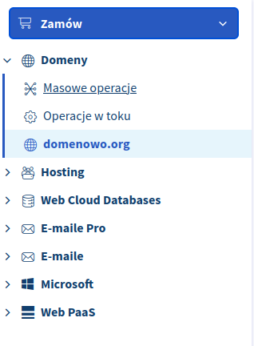
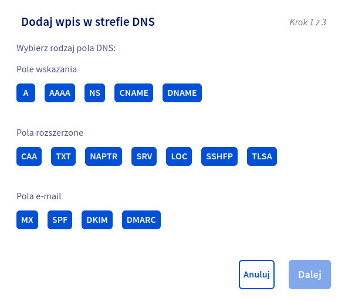
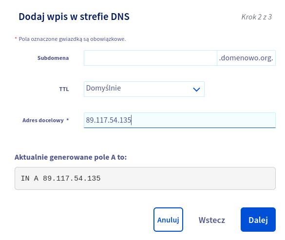

## Wprowadzenie do zarządzania domenami: Kluczowe informacje i narzędzia

Zarządzanie domenami to kluczowy element prowadzenia działalności w internecie. Domena to adres, pod którym znajduje się nasza strona internetowa, sklep czy blog. Właściwe zarządzanie domeną pozwala na utrzymanie jej w dobrej kondycji oraz zapewnia bezpieczeństwo i stabilność działania. W tym artykule przedstawimy najważniejsze informacje i narzędzia związane z zarządzaniem domenami.\
\
Warto pamiętać, że wybór odpowiedniej nazwy domeny ma duże znaczenie dla pozycjonowania strony w wyszukiwarkach internetowych. Dlatego warto przemyśleć tę kwestię już na etapie rejestracji domeny. Istotne jest również wybór właściwego rozszerzenia - np. .com, .pl czy .eu - które będzie najlepiej odpowiadało charakterowi naszej działalności.\
\
Do zarządzania domenami potrzebne są specjalne narzędzia, takie jak panel klienta u dostawcy usług hostingowych czy platformy do rejestracji i odnowienia domen. Ważnym elementem jest także znajomość terminologii związanej z DNS (Domain Name System), która pozwala na przypisanie adresu IP do nazwy domeny oraz umożliwia kierowanie ruchu na różne serwery.

## Ochrona przed kradzieżą domen: Strategie i zabezpieczenia

W dzisiejszych czasach, kradzież domen jest coraz bardziej powszechna. Dlatego ważne jest, aby zabezpieczyć swoje domeny przed nieuprawnionym dostępem. Jednym ze sposobów na ochronę przed kradzieżą domen jest wykorzystanie silnego hasła do konta rejestracyjnego. Hasło powinno składać się z co najmniej 8 znaków i zawierać kombinację liter, cyfr oraz znaków specjalnych. Ponadto możemy użyć menadżera haseł, takiego jak [1Password](https://1password.com/), [RoboForm](https://www.roboform.com/everywhere) lub [NordPass](https://nordpass.com/features/) \
\
Kolejnym sposobem na ochronę przed kradzieżą domen jest wykupienie usługi WhoisGuard. Usługa ta pozwala na ukrycie danych osobowych właściciela domeny w publicznie dostępnej bazie WHOIS. Dzięki temu potencjalni złodzieje nie będą mieli dostępu do Twoich danych osobowych i nie będą mogli ich wykorzystać w celach przestępczych.

### Główne zastosowanie Whois Guard obejmuje:

1. **Ochrona prywatności**: Dzięki Whois Guard, informacje osobowe właściciela domeny, takie jak imię, nazwisko, adres e-mail, numer telefonu, są zastępowane fikcyjnymi danymi, co pomaga w minimalizowaniu ryzyka niepożądanej publikacji danych osobowych i ogranicza narażenie na spam, phishing lub nadużycia.

1. **Zapobieganie spamowi**: Poprzez ukrywanie adresu e-mail właściciela domeny, Whois Guard pomaga zmniejszyć ilość otrzymywanych wiadomości spamowych, które są często generowane przez skanery danych publicznie dostępnych w bazie Whois.

1. **Ochrona przed kradzieżą tożsamości**: Publicznie dostępne informacje w bazie Whois mogą być wykorzystywane przez osoby trzecie do kradzieży tożsamości. Whois Guard zapewnia dodatkową warstwę ochrony, uniemożliwiając potencjalnym oszustom uzyskanie informacji prywatnych, które mogłyby zostać wykorzystane w celach nielegalnych.

1. **Zwiększenie bezpieczeństwa online**: Poprzez utrzymanie prywatności danych, Whois Guard pomaga w zabezpieczeniu przed niepożądanym uwidocznieniem informacji, które mogłyby być wykorzystane w celu ataku na witrynę lub naruszenia bezpieczeństwa online.

1. **Ochrona przed nadmiernym marketingiem**: Poprzez ukrywanie danych kontaktowych właściciela domeny, Whois Guard pomaga w uniknięciu niechcianych kontaktów od firm marketingowych, które korzystają z publicznie dostępnych informacji w celu nawiązania kontaktu z właścicielem domeny.

Jeśli chcesz jeszcze bardziej zabezpieczyć swoje domeny przed kradzieżą, warto włączyć dwuskładnikowe uwierzytelnianie logowania (2FA). Usługa ta wymaga podania dodatkowego kodu generowanego przez aplikację lub wysyłanego SMS-em przy każdorazowym logowaniu do konta rejestracyjnego. Dzięki temu nawet jeśli złodziej pozna Twoje hasło, nie będzie miał możliwości zalogowania się na Twoje konto bez podania dodatkowego kodu.

## Rejestracja i odnowienie domen: Najważniejsze kroki i terminy

Rejestracja i odnowienie domen to kluczowe kroki w zarządzaniu swoją stroną internetową. Pierwszym krokiem jest [wybór odpowiedniej nazwy domeny](https://www.domenowo.org/blog/jak-wybrac-nazwe-domeny/), która będzie łatwa do zapamiętania i wpisywania przez użytkowników. Następnie należy [sprawdzić dostępność](https://domenowo.org) wybranej nazwy w rejestrze domen. Warto pamiętać, że niektóre popularne nazwy mogą być już zajęte, dlatego warto mieć kilka alternatywnych propozycji.\
\
Po wyborze nazwy domeny należy zarejestrować ją u akredytowanego rejestratora. Rejestracja może być dokonana na różne okresy czasu, zazwyczaj od jednego do dziesięciu lat. Po upływie tego czasu konieczne jest odnowienie domeny, aby uniknąć jej utraty. Ważne jest, aby pamiętać o terminach odnowienia i dokonywać ich regularnie, ponieważ brak opłaty za przedłużenie może skutkować utratą domeny.

### Podczas rejestracji lub odnowienia domeny warto również zwrócić uwagę na dodatkowe usługi oferowane przez rejestratora, takie jak:

1. **Whois Guard**: Jak wspomniano wcześniej, wiele rejestratorów oferuje usługę Whois Guard lub Privacy Protection, która chroni prywatność właściciela domeny poprzez ukrywanie jego danych osobowych w bazie publicznej WHOIS. To pomaga zapobiegać spamowi, nadużyciom i kradzieżom tożsamości.

1. **Automatyczna odnowa**: Rejestratorzy często oferują funkcję automatycznego odnowienia rejestracji domeny, aby zapobiec jej przypadkowemu wygaśnięciu. To eliminuje potrzebę ręcznego odnawiania domeny i minimalizuje ryzyko utraty kontroli nad nią.

1. **Menedżer DNS**: Rejestratorzy często zapewniają narzędzia do zarządzania DNS, które umożliwiają łatwe skonfigurowanie rekordów DNS, takich jak rekordy A, CNAME, MX i inne. To pozwala na łatwe kierowanie domeny do odpowiednich serwerów lub usług.

1. **Ochrona anty-DDoS**: Niektórzy rejestratorzy oferują ochronę przed atakami DDoS, które mogą spowodować niedostępność Twojej strony internetowej. Ta usługa pomaga w zapewnieniu stabilności działania witryny nawet w obliczu ataków.

## Backup: Jak chronić swoje domeny przed utratą danych.

Backup to kluczowy element przy prowadzeniu biznesu. W dzisiejszych czasach, kiedy większość biznesów działa online, utrata danych może być katastrofalna dla firmy. Dlatego tak ważne jest, aby zabezpieczyć swoje domeny przed utratą informacji.\
\
Jednym z najważniejszych sposobów na ochronę swoich domen jest regularne tworzenie kopii zapasowych. Backup powinien być wykonywany regularnie, najlepiej codziennie lub co kilka dni. Dzięki temu w przypadku awarii lub ataku hakerskiego będziesz miał możliwość przywrócenia strony do poprzedniego stanu.\
\
Warto postawić na dywersyfikacje kopii zapasowych, t.j. oddzielić backupy od sieci logicznej oraz miejsca fizycznego gdzie znajduje się nasz serwer. Wykonanie kopii nic nam nie da, jeżeli spłonie w pożarze, lub ktoś włamię się do sieci i ją usunie.\
Polecane narzędzia do backupu:

- [IDrive](https://www.idrive.com/)
- [Veeam](https://www.veeam.com/vm-backup-recovery-replication-software.html?ad=menu-products)
- [Druva](https://www.druva.com/)
- [Acronis](https://www.acronis.com/pl-pl/)

## Zarządzanie DNS: Jak skonfigurować domenę

Konfiguracja DNS dla domeny jest istotnym krokiem w zapewnieniu prawidłowego funkcjonowania strony internetowej. Oto kilka kroków, które należy podjąć w celu skonfigurowania DNS dla domeny:

### Uzyskaj dostęp do panelu zarządzania DNS:

Zaloguj się do swojego konta u dostawcy usług DNS i znajdź panel zarządzania DNS dla swojej domeny. Zazwyczaj jest to osobny obszar w panelu klienta lub platformie dostawcy. Wybierz interesującą Cię domene.

### Skonfiguruj rekordy DNS:

Na panelu zarządzania DNS będziesz miał możliwość dodawania i edytowania rekordów DNS dla swojej domeny. Najczęściej spotykane rekordy to:

- **Rekord A (Address)**: Ten rekord łączy domenę z adresem IP serwera, na którym znajduje się Twoja strona internetowa. Wpisz odpowiednie IP serwera dla Twojej domeny.

- **Rekord CNAME (Canonical Name)**: Ten rekord pozwala na przekierowanie domeny na inny adres URL, na przykład na subdomenę lub inny serwer. Wpisz nazwę domeny lub subdomeny, na którą chcesz przekierować.

Jeżeli chcesz przekierować domenę na [VPS](https://pl.wikipedia.org/wiki/Virtual_private_server), wybierz rekord A. Następnie podaj adres IP serwera.

Po wprowadzeniu odpowiednich rekordów DNS zapisz zmiany. Może to zająć pewien czas, zwykle od kilku minut do kilku godzin, zanim zmiany zostaną zaktualizowane i zaczną działać. Sprawdź, czy konfiguracja działa poprawnie, odwiedzając swoją stronę internetową i sprawdzając, czy wszystko działa tak, jak powinno.\
\
Pamiętaj, że procedura konfiguracji DNS może się różnić w zależności od dostawcy usług DNS lub hostingu, dlatego zawsze warto sprawdzić dokumentację lub skontaktować się z pomocą techniczną, jeśli masz jakiekolwiek wątpliwości lub pytania dotyczące konfiguracji DNS dla swojej domeny.

### Jak zarządzać i chronić swoje domeny - podsumowanie

Posiadanie własnej domeny internetowej jest niezwykle istotne w dzisiejszych czasach zarówno dla firm, jak i osób prywatnych. W artykule przedstawiliśmy kompleksowe omówienie zarządzania i ochrony domeny, obejmujące konfigurację DNS, strategie ochrony przed kradzieżą, czym warto kiewrać się przy rejesteracji domeny, konfiguracje strefy DNS w OVHCloud, oraz pojęcie backupu. Zapoznanie się z tymi kluczowymi informacjami i zastosowanie najlepszych praktyk pomoże w utrzymaniu domeny w dobrej kondycji, zabezpieczeniu przed nieuprawnionym dostępem oraz zapewnieniu bezpieczeństwa i stabilności działania strony internetowej.
